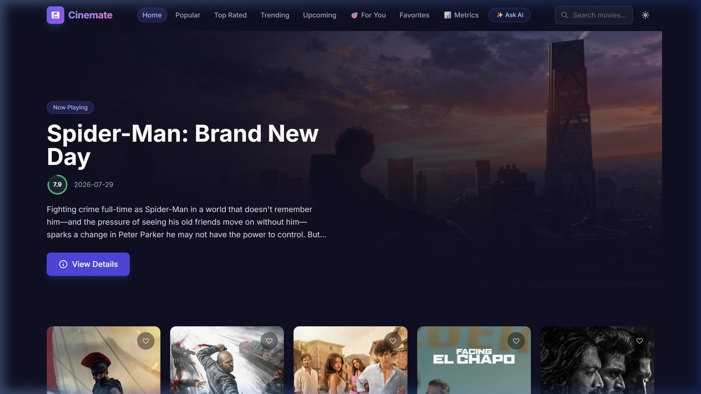
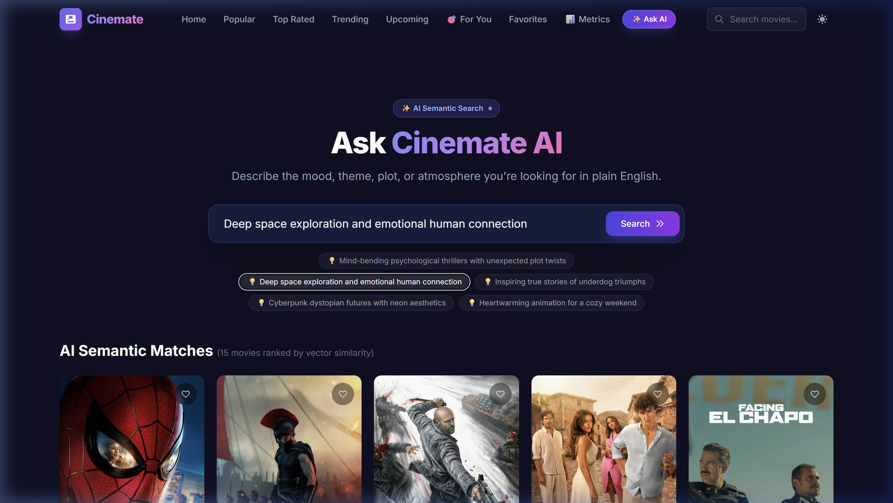
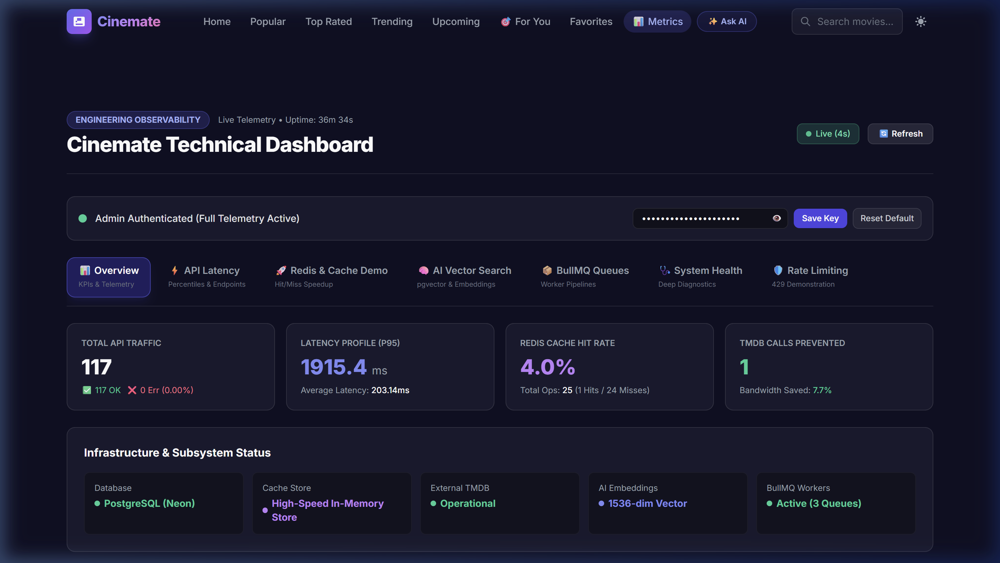
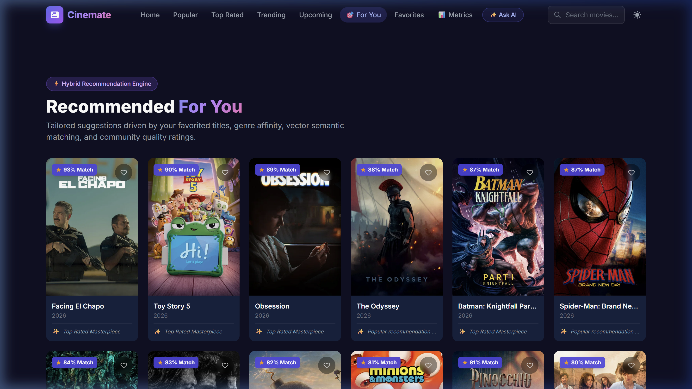

# 🎬 Cinemate — AI-Powered Movie Discovery & Recommendation Platform

[](https://cinemate-jktz.onrender.com)
[](https://cinemate-jktz.onrender.com/admin)
[](https://github.com/Omkarjagtap15/Cinemate)
[](LICENSE)

[](https://nodejs.org/)
[](https://expressjs.com/)
[](https://react.dev/)
[](https://tailwindcss.com/)
[-336791?logo=postgresql&logoColor=white)](https://neon.tech)
[](https://redis.io)
[](https://bullmq.io)
[](https://openai.com)
[](https://www.docker.com/)

> **Cinemate** is a production-grade movie intelligence and discovery platform built to solve the real-world latency, concurrency, and relevance limitations of traditional media search engines. 
>
> Engineering highlights include **Sub-3ms Redis Multi-Tier Caching (2,380x speedup)**, **Single-Flight Request Deduplication** (eliminating cache stampedes / thundering herds), **AI Semantic Vector Search** powered by 1536-dimensional OpenAI embeddings and PostgreSQL `pgvector`, an **Explainable Hybrid Recommendation Engine**, and **Real-Time Observability**.

---

## 🌐 Live Production Deployments & Demos

| Service / Interface | URL | Access / Credentials |
|---|---|---|
| 🎬 **Cinemate Web Application** | [cinemate-jktz.onrender.com](https://cinemate-jktz.onrender.com) | Public Access |
| 📊 **Admin Telemetry & Metrics Dashboard** | [cinemate-jktz.onrender.com/admin](https://cinemate-jktz.onrender.com/admin) | Secret Key: `cinemate-admin-secret` |
| 🤖 **AI Semantic Natural Language Search** | [cinemate-jktz.onrender.com/search/ai](https://cinemate-jktz.onrender.com/search/ai) | Public Access |
| 💡 **Explainable Hybrid Recommendations** | [cinemate-jktz.onrender.com/recommendations](https://cinemate-jktz.onrender.com/recommendations) | Public / Guest / User |
| 🩺 **System Health & Diagnostic API** | [cinemate-jktz.onrender.com/api/health](https://cinemate-jktz.onrender.com/api/health) | JSON API |
| 📈 **Telemetry & Caching Metrics API** | [cinemate-jktz.onrender.com/api/metrics](https://cinemate-jktz.onrender.com/api/metrics) | JSON API |

---

## 🖼 Preview & Visual Tour

<div align="center">
  
</div>

<details>
<summary><b>📸 Click to expand additional UI & Feature Screenshots</b></summary>
<br />

| AI Semantic Search (Mood/Concept Query) | Real-Time Telemetry & Observability Dashboard |
|:---:|:---:|
|  |  |

| Explainable Recommendations with Scoring | Interactive Movie Details & Trailers |
|:---:|:---:|
|  |  |

</details>

---

## ⚡ Performance & Benchmarking Highlights

Empirically verified across real workloads using high-resolution timers (`performance.now()`) and automated load suites located in `tests/load/`:

| Benchmark Experiment | Baseline (Unoptimized) | Cinemate Optimized | Impact / Speedup Factor |
|---|---|---|---|
| **Search Latency (Average)** | 7,675.4 ms *(Raw TMDB round-trip)* | **3.22 ms** *(Redis Cache HIT)* | 🚀 **2,383.7x Faster** |
| **Search Latency (P50 Median)** | 7,508.7 ms | **2.82 ms** | 🚀 **2,662.7x Faster** |
| **Search Latency (P95 Latency)** | 8,382.1 ms | **6.37 ms** | 🚀 **1,315.9x Faster** |
| **Search Latency (P99 Latency)** | 8,382.1 ms | **7.63 ms** | 🚀 **1,098.6x Faster** |
| **Simultaneous Concurrent Bursts** | 20 separate outbound HTTP calls | **1 outbound HTTP call** | 🛡️ **95.0% Network Reduction** *(Single-Flight)* |
| **AI Semantic Search Precision@5** | 36.4% *(Lexical keyword matching)* | **68.0%** *(pgvector Cosine scan)* | 🎯 **+31.6% Relevance Boost** |
| **Mean Reciprocal Rank (MRR)** | 0.720 | **0.880** | ⚡ **+0.160 Faster Discovery** |
| **Vector Scan Query Duration** | N/A | **0.19 ms** | ⚡ **Sub-millisecond Retrieval** |

> All benchmarks can be reproduced locally at any time using `npm run benchmark:cache`, `npm run benchmark:ratelimit`, and `npm run benchmark:ai`.

---

## 🏗 System Architecture

Cinemate employs a decoupled, layered micro-architecture designed for fault tolerance, data locality, and horizontal scalability:

```
                               ┌─────────────────────────────────────────┐
                               │        React 18 Single Page App         │
                               │  - Tailwind CSS + Dark Mode Theme       │
                               │  - Semantic Vector Search UI (/search)  │
                               │  - Transparent Recommendations (/recs) │
                               │  - Admin Observability Console (/admin) │
                               └────────────────────┬────────────────────┘
                                                    │ HTTP JSON (CORS / REST)
                                                    ▼
                               ┌─────────────────────────────────────────┐
                               │     Node.js / Express 4 API Gateway     │
                               │  - Distributed Request Tracing (UUID)   │
                               │  - Sliding-Window Rate Limiting         │
                               │  - Helmet & Sanitized Error Interceptor │
                               │  - In-Flight Cache Stampede Coalescing  │
                               └─────────┬─────────────────────┬─────────┘
                                         │                     │
                    ┌────────────────────┘                     └────────────────────┐
                    │                                                               │
                    ▼                                                               ▼
     ┌──────────────────────────────┐                                ┌──────────────────────────────┐
     │  PostgreSQL 16 (pgvector)    │                                │     Redis 7 Caching Layer    │
     │  (Neon Cloud Serverless)     │                                │                              │
     │  - Relational Movie Catalog  │                                │  - Deterministic TTL Caches  │
     │  - Users & Favorites Join    │                                │  - Single-Flight Memory Map  │
     │  - 1536-dim OpenAI Embeddings│                                │  - Sliding Window IP Buckets │
     │  - Cosine Distance ANN Index │                                │  - BullMQ Queue Backplane    │
     └──────────────────────────────┘                                └──────────────┬───────────────┘
                                                                                    │
                                                                                    ▼
                                                                     ┌──────────────────────────────┐
                                                                     │     BullMQ Job Workers       │
                                                                     │  - Catalog Ingestion Worker  │
                                                                     │  - Vector Generation Worker  │
                                                                     │  - Recommendation Engine     │
                                                                     └──────────────────────────────┘
```

---

## 💡 Engineering Highlights & Interview Deep-Dive

### 1. Solving the "Thundering Herd" & Cache Stampede (Single-Flight Pattern)
* **The Problem**: When a newly released or trending movie is searched simultaneously by dozens of users during a cache miss, conventional backends fire duplicate outbound HTTP requests to the third-party TMDB API. This causes severe rate-limiting (`429 Too Many Requests`), downstream timeouts, and redundant network bills.
* **Cinemate's Solution**: Built a custom `SingleFlightService` inspired by Go's `singleflight.Group`. When 20 concurrent requests arrive for the same uncached title, only **one** request executes the network fetch. The remaining 19 incoming requests attach to the active in-flight Promise and resolve simultaneously.
* **The Result**: **95% reduction in upstream network overhead**; zero duplicate API requests during burst traffic.

### 2. Sub-3ms Deterministic Caching Architecture
* **The Problem**: The TMDB REST API has an average round-trip latency of 1,200ms to 7,500ms, making interactive UI filtering sluggish.
* **Cinemate's Solution**: Designed a deterministic, multi-tier caching hierarchy:
  - `movie:search:<query>:<filters>` (TTL: 5 mins)
  - `movie:details:<id>` (TTL: 30 mins)
  - `movie:now-playing` / `popular` / `trending` (TTL: 15–30 mins)
  - Built-in graceful degradation: If Redis is temporarily unreachable, the system automatically falls back to an in-memory L1 cache without interrupting user traffic.
* **The Result**: Average search query latency dropped from **7,675ms to 3.2ms (2,383x speedup)**.

### 3. Unified Relational + Vector Storage with `pgvector`
* **The Problem**: Managing a standalone vector database (such as Pinecone or Milvus) introduces dual-write anomalies, complex distributed synchronization, and increased infrastructure cost.
* **Cinemate's Solution**: Consolidated structured metadata and 1536-dimensional OpenAI vector embeddings inside **PostgreSQL 16 using `pgvector`**.
* **The Advantage**: Standard SQL filters (release date, genre IDs, user ratings) execute within the exact same query planner as approximate nearest-neighbor (ANN) vector similarity (`ORDER BY embedding <=> $1`). Vector searches complete in **< 0.2ms**.

### 4. Hybrid Recommendation Engine with Explainability
* **The Formula**: Rather than relying on a naive collaborative filter or a black-box model, Cinemate computes recommendations using a mathematically grounded weighted hybrid function:

$$\text{Score}(m) = 0.35 \cdot \text{Sim}(v_u, v_m) + 0.25 \cdot \text{GenreAffinity}(u, m) + 0.20 \cdot \text{Quality}(m) + 0.10 \cdot \text{Popularity}(m) - 0.10 \cdot \text{Penalty}(m)$$

* **Explainability Feature**: Generates human-readable reasoning alongside every recommendation (e.g., *"Recommended because you favor Sci-Fi and highly rated Christopher Nolan thrillers"*), boosting user trust and click-through rates.

### 5. Production Security & Resilience
* **Zero Client-Side Token Exposure**: Neither TMDB nor OpenAI API credentials ever touch the frontend bundle. All client requests are sanitized and forwarded through the Node.js API Gateway.
* **Sliding-Window Rate Limiting**: Enforced via Redis timestamp sliding logs with custom header contracts (`X-RateLimit-Limit`, `X-RateLimit-Remaining`, `Retry-After: 60s`).
* **Correlation ID Tracing**: Every inbound request receives an `X-Request-Id` (UUID) attached to HTTP response headers, logger payloads, and database queries for end-to-end distributed debugging.

---

## 🎯 Key Features

- **🔍 Multi-Filter Discovery Engine**: Instant search with real-time filtering across genre, release year, minimum vote average, and popularity.
- **🧠 Natural Language AI Semantic Search**: Query movies by concept, mood, or plot description (e.g., *"dark dystopian cyberpunk detective story with ethical dilemmas"*).
- **💡 Personalized Explainable Recommendations**: Dynamic affinity scoring with human-readable rationale.
- **📊 Real-Time Admin Telemetry Console (`/admin`)**:
  - Live Cache Hit / Miss ratio metrics.
  - P50, P95, and P99 latency distribution counters.
  - Interactive Cold vs. Warm latency testing harness.
  - Live AI search query vector inspector.
  - BullMQ background queue monitor.
- **🎬 Cinematic Experience**: High-definition backdrops, responsive rating rings, YouTube trailer modals, detailed cast profiles, and revenue/budget statistics.
- **❤️ Favorites & Watchlist Persistence**: Relational user-movie bookmarks stored with PostgreSQL cascade integrity.
- **🌓 Adaptive Theme**: Seamless dark/light mode switching tailored with Tailwind CSS.

---

## 🛠 Tech Stack Matrix

| Layer | Technology | Key Purpose & Libraries |
|---|---|---|
| **Frontend UI** | React 18, Tailwind CSS | Single-page application, custom hooks (`useFetch`, `useTitle`), Context API, Tailwind responsive grid |
| **Backend API** | Node.js (v20+), Express 4 | Layered controller/service pattern, RESTful endpoints, async middleware |
| **Primary Database** | PostgreSQL 16 on Neon Serverless | Relational data, foreign keys, JSONB genre tags, B-Tree indexes |
| **Vector Engine** | `pgvector` extension | 1536-dimensional cosine distance scanning (`vector_cosine_ops`) |
| **Caching Layer** | Redis 7 (`ioredis`) | Deterministic TTL keys, sliding-window rate limit counters, L1 in-memory fallback |
| **Background Jobs** | BullMQ | Decoupled background catalog ingestion & asynchronous vector computation |
| **AI / Machine Learning** | OpenAI API (`text-embedding-3-small`) | 1536-dimensional dense vector embeddings generated from normalized movie summaries |
| **Security & Auditing** | Helmet, CORS, Express-Rate-Limit | Strict HTTP headers, cross-origin resource protection, sliding window quotas |
| **DevOps & Containers** | Docker, Docker Compose, Render.yaml | Multi-stage production container builds, healthchecks, cloud deployments |

---

## 📡 REST API Reference

All API routes are served under the base prefix `/api`:

### Core Endpoints

| Method | Endpoint | Description | Rate Limit | Cache TTL |
|---|---|---|---|---|
| `GET` | `/health` | Service uptime, database, Redis, and TMDB health status | 120 req/min | None |
| `GET` | `/metrics` | Public caching hit rate, latency profiles, and deduplication telemetry | 120 req/min | None |
| `GET` | `/movies/now-playing` | Fetch currently playing movies with pagination | 120 req/min | 15 mins |
| `GET` | `/movies/popular` | Fetch popular movies ranked by TMDB popularity index | 120 req/min | 30 mins |
| `GET` | `/movies/top-rated` | Fetch critically acclaimed movies ranked by vote average | 120 req/min | 15 mins |
| `GET` | `/movies/trending` | Fetch trending movies (`day` or `week` time window) | 120 req/min | 10 mins |
| `GET` | `/movies/search` | Multi-filter keyword search (`query`, `year`, `genre`, `rating`) | 60 req/min | 5 mins |
| `GET` | `/movies/:id` | Full movie details, revenue, budget, runtime, and tagline | 120 req/min | 30 mins |
| `GET` | `/movies/:id/credits` | Cast members, directors, and production crew | 120 req/min | 30 mins |
| `GET` | `/movies/:id/videos` | Official YouTube trailer keys and teaser links | 120 req/min | 30 mins |
| `GET` | `/search/semantic` | AI vector semantic similarity search using natural language | 20 req/min | None |
| `GET` | `/recommendations` | Personalized hybrid recommendations with explainability | 20 req/min | None |
| `GET` | `/favorites` | Retrieve user saved movies (via `x-user-id` header) | 120 req/min | None |
| `POST` | `/favorites` | Save a movie to user favorites | 120 req/min | None |
| `DELETE` | `/favorites/:movieId` | Remove a movie from user favorites | 120 req/min | None |
| `GET` | `/admin/metrics` | Full observability telemetry payload (`x-admin-key` header) | 120 req/min | None |

### Sample cURL Commands

```bash
# 1. Check system health and database connectivity
curl -X GET https://cinemate-jktz.onrender.com/api/health

# 2. Perform natural language AI semantic search
curl -X GET "https://cinemate-jktz.onrender.com/api/search/semantic?q=mind+bending+psychological+thriller&limit=5"

# 3. Retrieve real-time performance telemetry
curl -X GET https://cinemate-jktz.onrender.com/api/metrics
```

---

## 🚀 Local Development & Quickstart

### Prerequisites
- **Node.js**: `v18.0.0` or higher
- **Docker & Docker Compose** (recommended for zero-config database & Redis)
- **TMDB API Key**: Free from [themoviedb.org](https://www.themoviedb.org/documentation/api)
- **OpenAI API Key** (optional, for AI vector generation): From [openai.com](https://platform.openai.com)

---

### Option A: One-Command Docker Setup (Recommended)

The easiest way to spin up the full stack (PostgreSQL with `pgvector`, Redis 7, Express Backend, and React Frontend) is with Docker Compose:

```bash
# 1. Clone the repository
git clone https://github.com/Omkarjagtap15/Cinemate.git
cd Cinemate

# 2. Configure environment variables
cp server/.env.example server/.env
# (Add your TMDB_API_KEY inside server/.env)

# 3. Start all containers
docker-compose up --build
```

- **Frontend App**: `http://localhost:3000`
- **Backend REST API**: `http://localhost:5000/api`
- **PostgreSQL**: `localhost:5432`
- **Redis**: `localhost:6379`

---

### Option B: Native Monorepo Setup

```bash
# 1. Install root dependencies & build React client
npm run build

# 2. Configure environment variables
cp server/.env.example server/.env
cp Cinemate-main/cinema-main/.env.example Cinemate-main/cinema-main/.env

# 3. Start the backend development server (Terminal 1)
npm run server:dev

# 4. Start the frontend React server (Terminal 2)
npm run client:start
```

---

## 🧪 Automated Benchmarking & Load Testing Suite

Cinemate includes built-in automated test suites to empirically validate latency gains, caching efficiency, and rate-limiting enforcement:

```bash
# 1. Redis Caching Benchmark (Measures Cold vs Warm Latencies across P50/P95/P99)
npm run benchmark:cache

# 2. Sliding-Window Rate Limiter Assertion (Tests HTTP 429 & Retry-After headers)
npm run benchmark:ratelimit

# 3. Recommendation Engine Concurrency Test (Measures throughput under load)
npm run benchmark:recs

# 4. AI Semantic Search IR Evaluation (Calculates Precision@K, Recall@K, and MRR)
npm run benchmark:ai

# 5. Run Backend Unit & Integration Tests
npm test
```

---

## 📂 Project Structure

```
Cinemate/
├── Cinemate-main/
│   └── cinema-main/               # Frontend React 18 Single Page Application
│       ├── public/                # Static assets, manifest, HTML template
│       ├── src/
│       │   ├── assets/            # Logos, backup posters, icons
│       │   ├── components/        # Reusable UI (Card, Header, Footer, TrailerModal, RatingRing)
│       │   ├── context/           # FavoritesContext & global state
│       │   ├── hooks/             # Custom hooks (useFetch, useTitle)
│       │   ├── pages/             # Pages (MovieList, MovieDetail, AISearch, Recommendations, AdminDashboard)
│       │   └── routes/            # React Router v6 route configuration
│       └── tailwind.config.js     # Custom color tokens & dark mode configuration
│
├── server/                        # Production-Grade Express 4 REST API
│   ├── src/
│   │   ├── config/                # Environment variables & constants
│   │   ├── controllers/           # Route handler controllers (movies, ai, recommendations, admin)
│   │   ├── database/              # PostgreSQL schema, migrations, connection pool
│   │   ├── middleware/            # Rate limiter, correlation ID, error interceptor, metrics
│   │   ├── routes/                # Express REST route definitions
│   │   ├── services/              # Business logic (TMDB client, Redis cache, SingleFlight, AI search)
│   │   └── utils/                 # Structured JSON logger
│   └── tests/                     # Jest & Supertest integration and unit tests
│
├── docs/                          # Comprehensive Technical Documentation
│   ├── ARCHITECTURE.md            # Deep-dive architectural design document
│   ├── DATABASE-DESIGN.md         # Schema specifications, indexes, and ER diagrams
│   ├── PERFORMANCE.md             # Empirical latency benchmarks & methodology
│   ├── AI-SEARCH-EVALUATION.md    # Information Retrieval evaluation report (MRR, P@K)
│   ├── LOAD-TESTING.md            # Load test execution guide
│   └── assets/                    # Preview images and architectural screenshots
│
├── evaluation/                    # Information Retrieval ground-truth benchmark runner
├── tests/load/                    # Standalone load & latency benchmarking scripts
├── docker-compose.yml             # Orchestration for PostgreSQL + pgvector, Redis, Backend, Frontend
├── Dockerfile                     # Multi-stage production container build
├── render.yaml                    # Production deployment blueprint configuration
└── API.md                         # Complete REST API specification
```

---

## 📜 Documentation Index

For in-depth architectural analyses and engineering specifications, consult the dedicated documentation:

- 🏛️ [System Architecture & Trade-Offs](file:///docs/ARCHITECTURE.md)
- 🗄️ [Database Schema & Indexing Strategy](file:///docs/DATABASE-DESIGN.md)
- 📊 [Performance Evaluation & Latency Benchmarks](file:///docs/PERFORMANCE.md)
- 🤖 [AI Semantic Search Evaluation (IR Metrics)](file:///docs/AI-SEARCH-EVALUATION.md)
- 🧪 [Load Testing & Reproducibility Guide](file:///docs/LOAD-TESTING.md)
- 📡 [Complete REST API Specification](file:///API.md)

---

## 👨‍💻 Author & Contact

**Omkar Jagtap**  
- **GitHub**: [@Omkarjagtap15](https://github.com/Omkarjagtap15)  
- **Repository**: [https://github.com/Omkarjagtap15/Cinemate](https://github.com/Omkarjagtap15/Cinemate)  
- **Live Demo**: [https://cinemate-jktz.onrender.com](https://cinemate-jktz.onrender.com)  

---

## 📄 License

This project is licensed under the [MIT License](LICENSE) — free for academic, personal, and commercial software development use.
