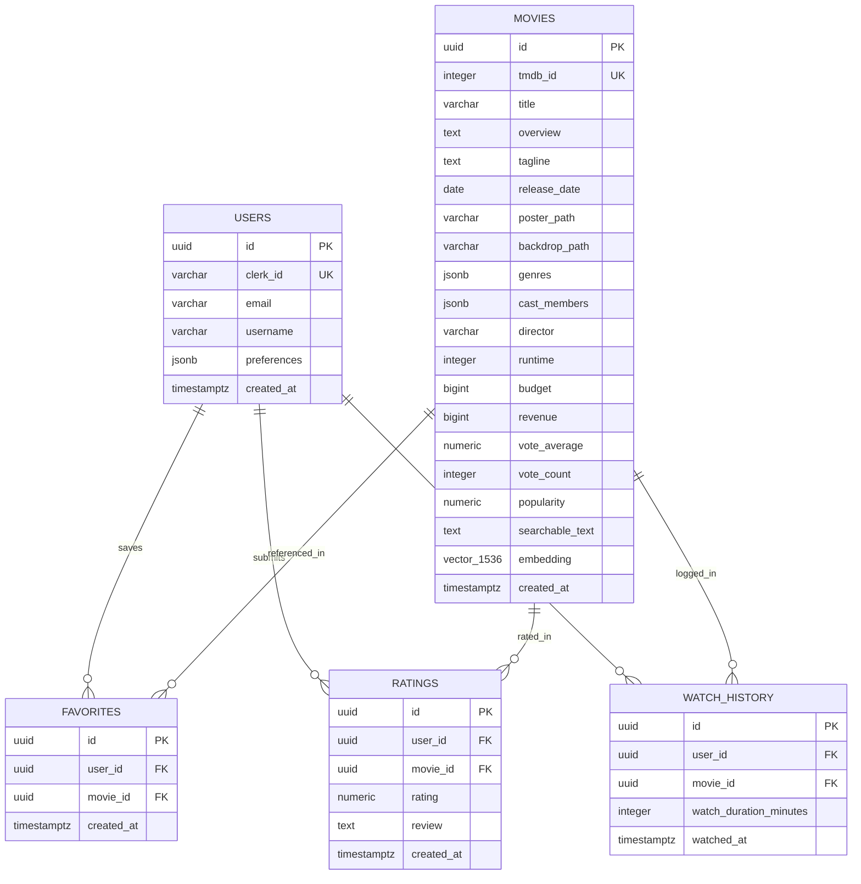

# Cinemate Database Architecture & Schema Design

Cinemate uses **PostgreSQL 16** with the **`pgvector`** extension (hosted on **Neon Serverless PostgreSQL**) as the primary transactional datastore and vector database.

---

## 1. Entity-Relationship Model (ERD)



---

## 2. Table Specifications & Indexes

### 2.1 `users` Table
Stores user identity synced from Clerk authentication.
```sql
CREATE TABLE IF NOT EXISTS users (
    id UUID PRIMARY KEY DEFAULT gen_random_uuid(),
    clerk_id VARCHAR(255) UNIQUE NOT NULL,
    email VARCHAR(255) UNIQUE NOT NULL,
    username VARCHAR(100),
    first_name VARCHAR(100),
    last_name VARCHAR(100),
    image_url TEXT,
    preferences JSONB DEFAULT '{"favorite_genres": [], "theme": "dark"}'::jsonb,
    created_at TIMESTAMP WITH TIME ZONE DEFAULT CURRENT_TIMESTAMP,
    updated_at TIMESTAMP WITH TIME ZONE DEFAULT CURRENT_TIMESTAMP
);
```

### 2.2 `movies` Table (with `pgvector`)
Stores normalized movie metadata and 1536-dimensional OpenAI vector embeddings.
```sql
CREATE TABLE IF NOT EXISTS movies (
    id UUID PRIMARY KEY DEFAULT gen_random_uuid(),
    tmdb_id INTEGER UNIQUE NOT NULL,
    title VARCHAR(500) NOT NULL,
    overview TEXT,
    tagline TEXT,
    release_date DATE,
    poster_path VARCHAR(500),
    backdrop_path VARCHAR(500),
    genres JSONB DEFAULT '[]'::jsonb,
    cast_members JSONB DEFAULT '[]'::jsonb,
    director VARCHAR(255),
    runtime INTEGER,
    budget BIGINT DEFAULT 0,
    revenue BIGINT DEFAULT 0,
    vote_average NUMERIC(3, 1) DEFAULT 0.0,
    vote_count INTEGER DEFAULT 0,
    popularity NUMERIC(10, 3) DEFAULT 0.0,
    searchable_text TEXT,
    embedding vector(1536),
    created_at TIMESTAMP WITH TIME ZONE DEFAULT CURRENT_TIMESTAMP,
    updated_at TIMESTAMP WITH TIME ZONE DEFAULT CURRENT_TIMESTAMP
);
```

### 2.3 `favorites` Table
Stores relational joins between users and saved favorite movies with unique constraints preventing duplicate saves.
```sql
CREATE TABLE IF NOT EXISTS favorites (
    id UUID PRIMARY KEY DEFAULT gen_random_uuid(),
    user_id UUID REFERENCES users(id) ON DELETE CASCADE,
    movie_id UUID REFERENCES movies(id) ON DELETE CASCADE,
    created_at TIMESTAMP WITH TIME ZONE DEFAULT CURRENT_TIMESTAMP,
    UNIQUE(user_id, movie_id)
);
```

---

## 3. Indexing Strategy & Query Optimization

| Index Name | Table | Column(s) | Type | Purpose |
|---|---|---|---|---|
| `idx_movies_tmdb_id` | `movies` | `tmdb_id` | B-Tree (Unique) | $O(1)$ fast lookups during ingestion & TMDB cross-referencing |
| `idx_movies_popularity` | `movies` | `popularity DESC` | B-Tree | High-speed ranking for home feeds and candidate filtering |
| `idx_movies_vote_average` | `movies` | `vote_average DESC` | B-Tree | Top-rated feeds and quality ranking |
| `idx_favorites_user_movie` | `favorites` | `user_id, movie_id` | B-Tree (Composite) | Sub-millisecond lookup of user favorites list |
| `idx_movies_embedding_cosine` | `movies` | `embedding vector_cosine_ops` | IVFFLAT / HNSW | Approximate Nearest Neighbor (ANN) search for AI semantic queries |

---

## 4. Why PostgreSQL + pgvector Was Chosen

1. **Transactional Simplicity**: Storing vectors directly inside the relational movie table eliminates dual-write anomalies and separate vector sync microservices (e.g. Pinecone / Milvus).
2. **Unified Filtering**: Standard SQL `WHERE` clauses (genre, year, rating) execute in the same query engine alongside cosine distance ranking (`ORDER BY embedding <=> $1`).
3. **Scale Rationale**: For catalogs up to 1,000,000 items, `pgvector` with IVFFLAT or HNSW indexing performs cosine distance scans in `< 5ms` with minimal operational overhead.
